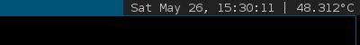

dwm-sss
======

#### Dynamic Window Manager Status Monitor

This is a very simple bash script to display the current date and time along with the CPU temperature in [DWM's](https://dwm.suckless.org/status_monitor/) status monitor.

This was designed to work with Raspbian OS on the RPI3, but if you modify the `/sys` temperature path, it should work on most UNIX system.

---

### Installation

1. Download the bash script and save to a location on your machine.
2. Use `chmod` to make it executable  (e.g. `chmod 700 dwm_sm`.
3. Edit your `~/.xinitrc` to include the following line:

```sh
/path/to/the/file/dwm_sm&
```

4. Call `xinit`/`startx` or reboot to start the daemon.

---

### Example

This is what the status bar should look like:



